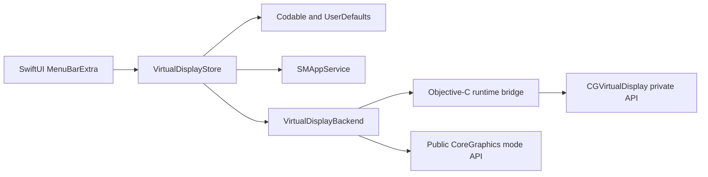

# Virtual Screen

Virtual Screen is a macOS menu bar app that creates virtual displays recognized by macOS.
It supports multiple simultaneous displays, common 16:9 and 16:10 resolutions, and native pixel modes up to 8K at 60 Hz.

> [!WARNING]
> Virtual Screen uses the private CoreGraphics `CGVirtualDisplay` API because macOS does not provide a public DisplayDriverKit or other public API for creating a system display.
> The app cannot be distributed through the Mac App Store, and a future macOS update may break compatibility.

## Requirements

- macOS 13.2 or later.
- Intel or Apple Silicon Mac.
- Xcode 15 or later to build from source.
- Direct distribution outside the Mac App Store.

## Features

- Menu bar interface with no Dock icon or persistent main window.
- Create, connect, disconnect, rename, and remove multiple virtual displays.
- Change each display resolution independently.
- Restore previously connected displays when the app starts.
- Register the app to launch at login by default, with a menu toggle to disable it.
- English and Traditional Chinese localization.
- Native LoDPI output at 60 Hz.
- One-time warning before the first 8K selection.

## Resolutions

| Aspect ratio | Native resolutions |
| --- | --- |
| 16:9 | 1280×720, 1366×768, 1600×900, 1920×1080, 2560×1440, 3200×1800, 3840×2160, 5120×2880, 7680×4320 |
| 16:10 | 1280×800, 1440×900, 1680×1050, 1920×1200, 2560×1600, 2880×1800, 3840×2400, 5120×3200, 7680×4800 |

4K and 8K labels describe native output pixels rather than a HiDPI logical workspace.
HiDPI and refresh rates other than 60 Hz are not included in this version.

## Build

Open `VirtualScreen.xcodeproj` in Xcode and run the `VirtualScreen` scheme.
The project has no third-party runtime dependencies and does not require a development team for an unsigned local build.

A command-line build can be run with:

```sh
DEVELOPER_DIR=/Applications/Xcode.app/Contents/Developer \
  xcodebuild \
  -project VirtualScreen.xcodeproj \
  -scheme VirtualScreen \
  -configuration Debug \
  -derivedDataPath .derivedData \
  CODE_SIGNING_ALLOWED=NO \
  build
```

`project.yml` is the XcodeGen source for the committed Xcode project.
Run `xcodegen generate` after changing target or build settings if XcodeGen is installed.

## Use

1. Launch Virtual Screen.
2. Click the overlapping-display icon in the menu bar.
3. Choose **Add Virtual Display**, an aspect ratio, and an initial resolution.
4. Open the new display submenu to disconnect it, reconnect it, change resolution, rename it, or remove it.
5. Arrange the display with macOS System Settings if needed.

A connected virtual display exists only while the app process retains it.
Quitting the app removes all live virtual displays while keeping their saved desired connection state for the next launch.

## Tests

The default test suite uses a fake display backend and never creates a real virtual display.

```sh
DEVELOPER_DIR=/Applications/Xcode.app/Contents/Developer \
  xcodebuild \
  -project VirtualScreen.xcodeproj \
  -scheme VirtualScreen \
  -derivedDataPath .derivedData \
  CODE_SIGNING_ALLOWED=NO \
  test
```

An opt-in integration test creates a real 1920×1080 virtual display, switches it to 1920×1200, verifies its CoreGraphics pixel dimensions, and then disconnects it.

```sh
DEVELOPER_DIR=/Applications/Xcode.app/Contents/Developer \
  xcodebuild \
  -project VirtualScreen.xcodeproj \
  -scheme VirtualScreen \
  -derivedDataPath .derivedData \
  CODE_SIGNING_ALLOWED=NO \
  RUN_VIRTUAL_DISPLAY_TESTS=1 \
  -only-testing:VirtualScreenTests/LiveVirtualDisplayTests/testCreatesAndSwitchesARealVirtualDisplayWhenExplicitlyEnabled \
  test
```

## Architecture



The Objective-C bridge resolves private classes with `NSClassFromString` and checks every required selector before use.
Only the small selector surface needed by the app is declared locally.
The app does not statically reference private CoreGraphics class symbols, so unsupported systems fail gracefully instead of crashing at launch.

## Distribution and signing

App Sandbox is disabled because this project is intended for direct distribution and uses private API.
The project does not contain a Developer ID certificate or development team identifier.
For public direct downloads, configure your Apple Developer team, sign the Release archive with Developer ID Application, enable hardened runtime, and notarize the final app outside this repository.

## Limitations

- This app is not eligible for the Mac App Store.
- 8K and multiple high-resolution virtual displays can consume substantial memory and GPU resources.
- The maximum number and resolution of displays depend on the Mac GPU and macOS version.
- macOS may reject a mode or an additional display when a system limit is reached.
- Custom resolutions, HiDPI, variable refresh rates, display arrangement, mirroring, streaming, and recording are out of scope.
- Creating a virtual display does not itself provide a way to view its contents; use macOS display arrangement, screen sharing, capture, or streaming software as appropriate.

## License

Virtual Screen is available under the [MIT License](LICENSE).
