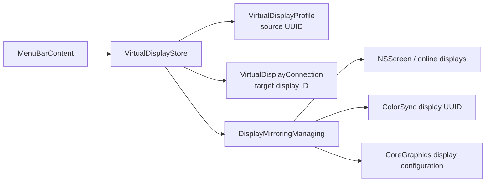

# Display Mirroring Plan

## Goal

讓使用者可從每個已連線虛擬螢幕的 menu 選擇一個實體螢幕作為同步來源、切回延伸顯示，並在 App 重啟、虛擬螢幕重新連線、Mac 喚醒或來源螢幕重新出現後自動恢復所選同步設定。

## Context

- `VirtualDisplayConnection.displayID` 已提供虛擬螢幕的 `CGDirectDisplayID`。
- `VirtualDisplayStore` 負責 profile、連線生命週期、喚醒重連與錯誤呈現。
- `VirtualDisplayProfile` 目前只持久化名稱、解析度與期望連線狀態。
- `MenuBarContent` 已將各虛擬螢幕的操作集中在 profile submenu。
- macOS 13.2 deployment target 可使用公開的 `CGConfigureDisplayMirrorOfDisplay`、`CGDisplayMirrorsDisplay`、`CGGetOnlineDisplayList`，以及 ColorSync 的 display UUID API。建立虛擬螢幕仍依賴既有 private `CGVirtualDisplay` bridge。

## Architecture

- 新增 `DisplayMirroringManaging` service，封裝以下系統責任：
  - 列出 online display，排除目前 connection IDs 與 Virtual Screen vendor `0x4E52`，避免跨程序的 Virtual Screen 被誤列為來源。
  - 以 `NSScreen.localizedName` 提供使用者可辨識的來源名稱。
  - 使用 ColorSync display UUID 作為跨程序與重新連線的穩定來源識別，不持久化短期有效的 `CGDirectDisplayID`。
  - 使用 `CGBeginDisplayConfiguration`、`CGConfigureDisplayMirrorOfDisplay` 與 `CGCompleteDisplayConfiguration(..., .forSession)` 套用或解除同步。
  - 使用 `CGDisplayMirrorsDisplay` 驗證實際同步結果。
- `VirtualDisplayProfile` 新增 optional 的來源 UUID，表示「期望的同步來源」。缺少欄位的既有 JSON 應解碼為 `nil`，維持 persistence version 1 相容性。
- `VirtualDisplayStore` 注入 mirroring service，負責將 profile UUID、目前 source display ID 與 target connection display ID 串接；明確操作成功後才更新持久化設定。
- 重新建立虛擬螢幕連線後先取得新的 target display ID，再恢復同步。來源暫時不存在時保留 UUID，待喚醒或螢幕參數變更通知後重試。
- 使用 `NSApplication.didChangeScreenParametersNotification` 重新整理來源與重試未恢復設定；套用前比較目前 mirror source，避免同步操作本身觸發通知後形成循環。
- profile submenu 新增「同步顯示」子選單，包含「不同步」與可用來源。同步中停用手動解析度切換，並清楚標示解析度由來源螢幕控制。

## Non-Goals

- 不串流單一視窗或 App；只使用 macOS display mirroring。
- 不讓一個虛擬螢幕同時同步多個來源。
- 不保證同步時沿用 profile 原先選擇的虛擬解析度；顯示模式由 macOS 與來源螢幕的相容模式決定。
- 不永久改寫 macOS display arrangement；系統設定使用 `.forSession`，長期意圖由 App 自己持久化及恢復。

## Assumptions

- 使用者已確認同步選擇需在 App 重啟與 Mac 喚醒後自動恢復。
- 來源清單包含可取得穩定 UUID 的 online display，但排除目前 virtual connection IDs 與 Virtual Screen vendor `0x4E52`。
- 使用者主動中斷 profile 時保留來源 UUID，重新連線時恢復同步；選擇「不同步」或移除 profile 才清除該設定。
- 若來源不存在，App 保留期望設定但不顯示阻斷式錯誤；使用者主動選擇來源而套用失敗時才顯示既有 error dialog。

## Risks

- `CGConfigureDisplayMirrorOfDisplay` 是公開 API，但與 private `CGVirtualDisplay` 組合的實際行為必須在支援硬體上做 opt-in live test。
- 同步會短暫重設顯示配置，可能改變視窗位置或可用解析度；live test 必須以 `defer` 先解除同步再銷毀虛擬螢幕。
- 外接螢幕可能沒有唯一或友善的名稱；UUID 用於識別，重複名稱需在 menu 內以穩定順序編號區分。
- Display reconfiguration notification 可能連續觸發；恢復流程需具備 in-flight guard、狀態比較與有限重試，避免設定迴圈。

## Plan

- [ ] 建立最小 opt-in feasibility test，於 `VirtualScreenTests/LiveVirtualDisplayTests.swift` 建立虛擬螢幕、將它同步至一個非 Virtual Screen online display、用 `CGDisplayMirrorsDisplay` 驗證，再於 `defer` 解除同步。2026-08-31 discovery：CoreGraphics mirror/unmirror 對兩個 virtual displays 已通過，但目前測試機只有 vendor `0x4E52` 的既有 Virtual Screen、沒有實體來源；final live test 會安全跳過 mirroring，需接上實體螢幕後重跑 `just test-live` 才能關閉此項。
- [x] 在 `project.yml` 加入 ColorSync framework 並以 `just generate` 更新 Xcode project；`DisplayUUID` 提供 UUID round-trip，`DisplayMirroringManagerTests` 已驗證 main display 可解析回目前 `CGDirectDisplayID`。
- [x] 新增 `VirtualScreen/Services/DisplayMirroringManager.swift` 的 `DisplayMirrorSource`、`DisplayMirroringManaging` 與 CoreGraphics implementation；來源列舉會排除傳入的 virtual IDs、區分重複名稱、以 `.forSession` 套用或解除同步，並將非 `.success` 的 `CGError` 映射成可本地化錯誤。
- [x] 擴充 `VirtualScreenTests/TestDoubles.swift`，加入可控制來源清單、套用錯誤、實際狀態、reentrant callback 與 request history 的 fake mirroring manager；store tests 未操作真實顯示配置。
- [x] 在 `VirtualScreen/Models/VirtualDisplayProfile.swift` 新增 optional `mirrorSourceID`，`PersistenceTests` 已驗證新資料 round-trip，以及不含新欄位的 version 1 JSON 載入後預設為不同步。
- [x] 在 `VirtualScreen/Store/VirtualDisplayStore.swift` 注入 mirroring manager，公開可用與實際來源並實作選擇來源／不同步；單元測試已證明成功才持久化、失敗維持原設定並回報錯誤。
- [x] 將同步恢復接到 `connectProfile`、`start`、`retryDesiredConnectionsAfterWake` 與 `NSApplication.didChangeScreenParametersNotification`；單元測試已涵蓋 target ID 改變、來源重新出現、通知重入、喚醒恢復及主動中斷保留來源。
- [x] 修正自動恢復設定失敗時的狀態誤導：Store 保留可見失敗狀態，menu 以實際來源顯示 checkmark；`testRestoreFailureExposesActualStateAndClearsAfterRetry` 驗證後續重試成功會清除失敗。
- [x] 在中斷、移除與 unexpected termination 流程以 best-effort 清理實際 mirror session；測試已證明中斷保留 UUID、移除刪除設定、termination 清除實際狀態。
- [x] 更新 `VirtualScreen/UI/MenuBarContent.swift`，於已連線 profile 加入「同步顯示」submenu，提供「不同步」、來源清單、目前選項 checkmark 與來源不可用狀態；同步中停用解析度並顯示由來源控制。
- [x] 更新英文與台灣正體中文 `Localizable.strings`，涵蓋同步選單、不可用來源、解析度受來源控制與 CoreGraphics 錯誤；`just test` 的 Debug build 已驗證 strings 可編譯。
- [x] 更新 `README.md` 的使用方式與限制，說明同步來源選擇、自動恢復，以及同步模式由 macOS 控制相容解析度。
- [x] 執行 `just test` 與 `just test-live`。證據：`just test` 通過 32 tests（1 個 opt-in skip）；`just test-live` 的 create、resolution switch 與 cleanup 通過，但因測試機沒有非 Virtual Screen 實體來源，mirror/unmirror 部分安全跳過。
- [ ] 在至少有內建與外接螢幕其中一種來源的 Mac 手動驗收：選擇來源後畫面同步、選擇不同步後恢復延伸、斷線重連後恢復、App 重啟後恢復、睡眠喚醒後恢復、來源拔除與接回後恢復。2026-08-31 blocker：目前測試機的唯一 online display 是既有 Virtual Screen，需接上實體螢幕後完成並將結果記錄在 PR。

## Completion Checklist

- [ ] 每個已連線虛擬螢幕可選擇一個 online 非本 App virtual display 作為同步來源，或切回不同步。
- [x] Menu 實作目前來源 checkmark、來源不可用與同步解析度限制；英文及台灣正體中文 strings 均通過 Debug 與 Release build。
- [x] 同步來源以 ColorSync UUID 持久化；persistence tests 證明既有 version 1 資料不需重設且可正常載入。
- [x] Store tests 證明啟動、重新連線、喚醒及來源重新出現後會恢復同步，且 reentrant notification 不會形成重複設定迴圈。
- [x] 中斷、移除、termination 與測試失敗路徑具備 regression coverage；CoreGraphics configuration 使用 `.forSession`，不寫入永久 display configuration。
- [ ] `just test` 與 `just test-live` 通過，手動驗收結果已附於 PR，沒有未處理的 material unknown 或高風險失敗。
